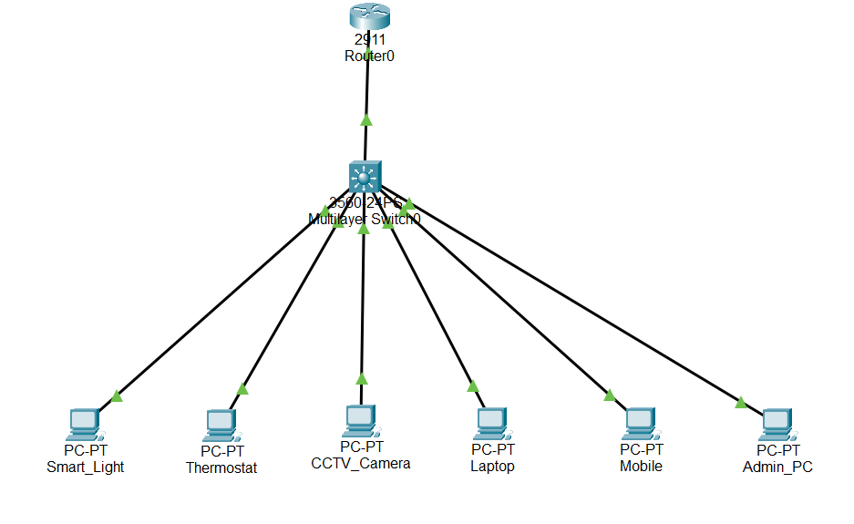

# Smart Home VLAN Network Simulation  
**Created by: Rashmi Jannu**

##  Overview
This project simulates a **Smart Home network environment** using **Cisco Packet Tracer**, where different types of devices (IoT, personal, security, and admin) are segregated using **VLANs** to enhance security, traffic control, and network management.

---

##  Devices Used
- **Router:** Cisco 2911  
- **Multilayer Switch:** Cisco 3560-24PS  
- **End Devices (simulated as PCs):**
  - Smart Light
  - Thermostat
  - CCTV Camera
  - Laptop
  - Mobile
  - Admin PC

---

##  VLAN Structure
| VLAN ID | Name         | Devices                 |
|---------|--------------|--------------------------|
| 10      | IoT          | Smart Light, Thermostat  |
| 20      | Security     | CCTV Camera              |
| 30      | Personal     | Laptop, Mobile           |
| 99      | Management   | Admin PC                 |

---

##  IP Addressing Scheme
| VLAN | Subnet             | Gateway         |
|------|--------------------|-----------------|
| 10   | 192.168.10.0/24    | 192.168.10.1    |
| 20   | 192.168.20.0/24    | 192.168.20.1    |
| 30   | 192.168.30.0/24    | 192.168.30.1    |
| 99   | 192.168.99.0/24    | 192.168.99.1    |

---

##  Configuration Summary
- Created VLANs and assigned them to switch ports
- Enabled Inter-VLAN routing on the multilayer switch using SVI (Switched Virtual Interfaces)
- Set static IP addresses for all end devices according to their VLAN subnet
- Verified connectivity via `ping` across VLANs and gateway interfaces

---

##  Learning Outcomes
- Practical implementation of VLANs on Cisco devices
- Experience with multilayer switch routing (SVI configuration)
- Understanding of network segmentation and role-based device grouping
- Hands-on skills with Cisco Packet Tracer in simulating a smart environment

---

##  Files
- `smart-home.pkt` – Packet Tracer project file (upload once completed)
- `report.pdf` – Detailed project documentation  
- `README.md` – This file for GitHub repository

---

##  Network Topology

